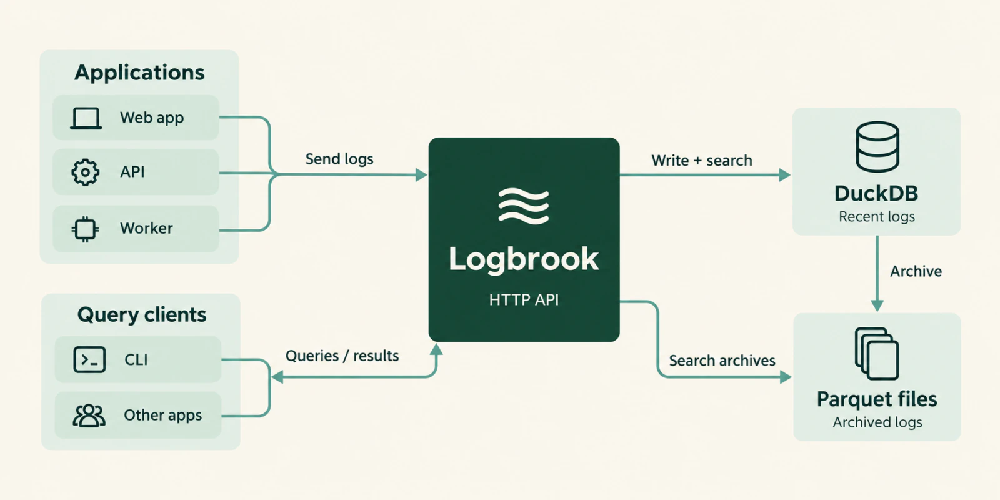

<h1></h1>

[](https://github.com/sandrinodm/logbrook/pkgs/container/logbrook)

Lightweight, self-hosted log search for structured application logs.

Logbrook is a single Rust executable that receives JSON logs over HTTP, stores recent events in an embedded DuckDB database, moves older events into local Parquet files, and searches both through its CLI and HTTP API. It runs on one server with one data directory and needs no external database or message queue.

> **Status:** Logbrook is pre-release software. Build it from source as described below. APIs and storage formats may change before a stable release.

## Features

- **HTTP ingestion** of Pino-style JSON arrays or NDJSON, authenticated with ingestion tokens that each map to a source. Success is returned only after the batch is committed.
- **Named indexes**, each with its own retention period and disk-size target. The first authorized write to a new index creates it, up to a configurable index limit.
- **Search** by time range, source, service, logger, host, minimum level, and message substring, with cursor pagination, counts, facets, and histograms.
- **Live tail** over server-sent events, with replay after reconnects and an explicit notice when events were missed.
- **Parquet archival** of older events, which stay searchable together with recent ones.
- **CLI** in the same executable for querying, counting, and managing indexes on a running server.
- **Offline import** of Pino JSON or NDJSON files.
- **Operations support**: Prometheus metrics, health and readiness endpoints, and a hardened container image.

## How it works

Applications send logs to Logbrook over HTTP. Each index stores recent logs in embedded DuckDB and archives older logs as local Parquet files. The CLI and other applications query both through Logbrook's HTTP API.



## Quick start

These steps build Logbrook from source and run it in the foreground on `127.0.0.1:3100`. Run every command from the repository root.

### Prerequisites

- **Rust** via [rustup](https://rustup.rs). The repository pins Rust 1.99.0 in `rust-toolchain.toml`; rustup installs that version on the first `cargo` command.
- **A C++ compiler** for the bundled DuckDB build. On macOS, install the Xcode command-line tools with `xcode-select --install`.
- **`openssl` and `curl`** for the commands below.

If `cargo` is not found right after installing Rust, run `. "$HOME/.cargo/env"` or open a new shell.

### 1. Build

```sh
cargo build --package logbrook --locked --release
```

The first build compiles DuckDB from source and takes several minutes.

### 2. Start the server

Generate separate ingestion and read credentials, print them so you can use them in another terminal, and start the server:

```sh
export LOGBROOK_INGEST_TOKEN="$(openssl rand -hex 24)"
export LOGBROOK_READ_TOKEN="$(openssl rand -hex 24)"
echo "Ingest token: $LOGBROOK_INGEST_TOKEN"
echo "Read token:   $LOGBROOK_READ_TOKEN"

target/release/logbrook check-config
target/release/logbrook serve
```

`serve` stays in the foreground and writes JSON logs to stderr. Press Ctrl-C to stop it. Without a configuration file, Logbrook listens on `127.0.0.1:3100`, stores data in `./data`, keeps events for seven days, and has no disk-size target.

### 3. Send an event

Open a second terminal in the repository root. Set the ingestion token printed in step 2, then send one event to an index named `payments`:

```sh
export LOGBROOK_INGEST_TOKEN='<ingest token from step 2>'

curl --fail http://127.0.0.1:3100/indexes/payments/logs/ingest \
  -H "Authorization: Bearer $LOGBROOK_INGEST_TOKEN" \
  -H 'Content-Type: application/json' \
  --data "[{\"time\":$(( $(date +%s) * 1000 )),\"level\":30,\"service\":\"checkout\",\"msg\":\"Order accepted\",\"orderId\":\"demo-1\"}]"
```

The response is `{"accepted":1}`. Because `payments` did not exist yet, this write also created the index.

### 4. Search

Set the read token in the second terminal, then search the `payments` index with the CLI:

```sh
export LOGBROOK_READ_TOKEN='<read token from step 2>'
target/release/logbrook query payments --since 1h
```

The table shows the matching event. Add `--json` to see the complete record, including its `orderId` attribute.

## Run with Docker Compose

Compose builds the image locally, so Docker is the only build prerequisite on the host. Both credentials must be set in the shell that runs Compose:

```sh
export LOGBROOK_INGEST_TOKEN="$(openssl rand -hex 24)"
export LOGBROOK_READ_TOKEN="$(openssl rand -hex 24)"
docker compose up --build -d
```

Keep both values. You need the read token to query logs, and Compose requires both whenever it recreates the container. To enable index deletion, also export `LOGBROOK_ADMIN_TOKEN` before starting Compose.

The service is published on the host's `127.0.0.1:3100` and stores data in the `logs` named volume. Compose defaults to seven-day retention, a 20 GB size target per index, and at most four indexes. The [retention settings](#retention-and-disk-size) below can be exported before `docker compose up -d` to change them.

The runtime image is digest-pinned Distroless with no shell. The container runs as UID 10001 with a read-only root filesystem, no Linux capabilities, and a 35-second shutdown grace period. Compose sets no CPU or memory limit. Logbrook serves plain HTTP; put a TLS-terminating reverse proxy in front of it before exposing it beyond the local machine. See [container packaging](docs/CONTAINER.md) for image details and verification.

## Send logs from an application

Send batches to `POST /indexes/{index}/logs/ingest` as a JSON array (`application/json`) or as NDJSON (`application/x-ndjson`), with an ingestion token in the `Authorization: Bearer` header. Each event needs an integer Unix-millisecond `time`, a nonnegative integer `level`, and a string `msg`, which are Pino's defaults.

| Event field | Stored as |
| --- | --- |
| `time`, `level`, `msg` | `event_time`, `level`, `message` |
| `service`, `name`, `hostname`, `pid` | `service`, `logger`, `host`, `pid` |
| Any other field | `attributes` |

The `source` comes from the ingestion token, and the server generates each event ID. Payload fields with those names are kept in `attributes` and cannot override them.

By default, a request may contain up to 1,000 events and 1 MiB, each event up to 64 KiB, each string value up to 4,096 bytes, and nesting up to 16 levels. A batch is validated as a whole, so one invalid event rejects the entire request. Live ingestion also rejects events older than the index's retention window or more than five minutes in the future.

For a complete Node.js setup with batching, child loggers, error serialization, a paced bulk generator, and graceful shutdown, see the [Pino example](examples/pino-logger/README.md).

## Use the CLI

The `logbrook` executable is also an HTTP client for a running server. It reads the server address from `LOGBROOK_URL` (default `http://127.0.0.1:3100`) and chooses a credential from the role variables described in [Credentials](#credentials):

```sh
logbrook indexes list                  # Size, size target, retention, readiness
logbrook indexes show payments --json  # Database, WAL, archive and temp bytes
logbrook query payments --since 1h --message error --limit 50
logbrook count payments --since 7d --min-level 40
logbrook indexes create audit
logbrook indexes delete audit --yes    # Admin token only; permanently removes data
```

If `logbrook` is not on your `PATH`, use `target/release/logbrook` from the repository root. Add `--json` for machine-readable output. The [CLI guide](docs/CLI.md) covers credentials, pagination, deletion, and use inside the container. The [query cookbook](docs/QUERY-EXAMPLES.md) has a twelve-event demo with expected results and recipes for filtering, exports, facets, histograms, and live tail.

## Configuration

Settings are resolved in this order: built-in defaults, then an optional TOML file passed with `--config`, then supported `LOGBROOK_*` environment variables.

```sh
cp logbrook.example.toml logbrook.local.toml
# Edit logbrook.local.toml and replace every replace-with-... credential.
target/release/logbrook --config logbrook.local.toml check-config
target/release/logbrook --config logbrook.local.toml serve
```

Files named `*.local.toml` are ignored by Git. Environment variables still override the file, so unset the quick-start token variables if you want the file's credentials to apply.

### Credentials

Logbrook has three roles. Each credential must contain 16 to 512 visible ASCII characters with no whitespace, and the roles must use different values. Example values beginning with `replace-with-` are rejected.

| Role | Environment | TOML | Grants |
| --- | --- | --- | --- |
| Ingestion | `LOGBROOK_INGEST_TOKEN`, with its source in `LOGBROOK_SOURCE` (default `default`) | `[ingest_tokens]`: token to source name | Writing events and creating indexes |
| Read | `LOGBROOK_READ_TOKEN`, with allowed sources in `LOGBROOK_READ_SOURCES` | `[read_tokens]`: token to a list of sources; an empty list allows all | Search, count, facets, histograms, live tail, and listing indexes; `/metrics` when unrestricted |
| Admin (optional) | `LOGBROOK_ADMIN_TOKEN` | `admin_tokens` | Listing, inspecting, creating, and deleting indexes; no access to events or metrics |

- `LOGBROOK_INGEST_TOKEN` replaces all ingestion tokens from the TOML file, and `LOGBROOK_ADMIN_TOKEN` replaces `admin_tokens`.
- `LOGBROOK_READ_TOKEN` is added to the readers from the TOML file. If the file already defines readers, also set `LOGBROOK_READ_SOURCES` to a comma-separated list, or to an empty value for all sources. Without configured readers, the environment reader can read all sources.
- Optional `[ingest_index_scopes]` and `[read_index_scopes]` tables restrict tokens to named indexes. Source scopes still apply.
- `/health` and `/ready` are public and reveal no log data.

### Indexes

- Index names have 1 to 63 lowercase letters, digits, hyphens, or underscores, and start with a letter or digit.
- The `default` index always exists. The unprefixed `/logs` routes address it.
- An index is created by the first authorized ingestion, by `PUT /indexes/{index}` (`logbrook indexes create`), or by declaring it in TOML as `[indexes.<name>]` or with `LOGBROOK_INDEXES=payments,audit`.
- At most `max_indexes` indexes may exist, four by default including `default`. Raise the limit with `LOGBROOK_MAX_INDEXES` or delete unused indexes with an admin token. The `default` index and declared indexes cannot be deleted.
- Each index lives in `<data_dir>/indexes/<name>/`. Existing index directories are discovered at startup.
- DuckDB memory, temporary-disk, and writer-queue budgets are divided across all `max_indexes` slots, so raising the limit gives each index a smaller share unless you also raise the totals.

### Retention and disk size

| Setting | TOML | Environment | Native default | Compose default |
| --- | --- | --- | --- | --- |
| Retention by event time | `retention_days` | `LOGBROOK_RETENTION_DAYS` | 7 days | 7 days |
| Disk-size target per index, decimal GB | `max_size_gb` | `LOGBROOK_MAX_SIZE_GB` | None | 20 |
| Maximum number of indexes | `max_indexes` | `LOGBROOK_MAX_INDEXES` | 4 | 4 |
| Move events to Parquet after | `archive_after_ms` | `LOGBROOK_ARCHIVE_AFTER_MS` | 1 day | 1 day |
| Maintenance interval | `maintenance_interval_secs` | `LOGBROOK_MAINTENANCE_INTERVAL_SECS` | 60 seconds | 60 seconds |

Top-level TOML values are inherited by every index, and `[indexes.<name>]` tables override them:

```toml
retention_days = 30
max_size_gb = 20

[indexes.audit]
retention_days = 90
max_size_gb = 5
```

- Limits apply to each index separately. 20 GB means 20,000,000,000 bytes.
- Changes take effect on restart. A shorter retention can expire events on the first maintenance pass; a longer one never restores expired events.
- Retention must be longer than the archive age.
- The size target counts database, WAL, archive, and temporary files. Maintenance expires the oldest events first, and ingestion returns `507` while the index remains at its target. It is not a hard ceiling: writes, maintenance, and query spill can briefly exceed it, and DuckDB can keep freed space allocated. Use a filesystem or volume quota when you need a hard limit.
- `retention_ms` (`LOGBROOK_RETENTION_MS`) and `max_size_bytes` (`LOGBROOK_MAX_SIZE_BYTES`) are also accepted. Do not set both units for the same setting in the environment.

The [operations guide](docs/OPERATIONS.md) documents every limit and setting, size-target behavior, backup and restore, upgrades, migration from the older flat data layout, and offline imports.

## HTTP API

The [API reference](docs/API.md) covers authentication, request and response formats, errors, and live tail. The [OpenAPI contract](src/openapi.json) is also served at `/openapi.json`.

| Endpoint | Purpose |
| --- | --- |
| `GET /indexes` | List the indexes the credential may access |
| `PUT /indexes/{index}` | Create an index (ingestion or admin credential); idempotent |
| `GET /indexes/{index}` | Show an index's measured size, retention, and readiness |
| `DELETE /indexes/{index}` | Permanently delete a dynamic index (admin credential) |
| `POST /indexes/{index}/logs/ingest` | Ingest a JSON array or NDJSON batch |
| `GET /indexes/{index}/logs` | Search, newest first, with an optional cursor |
| `GET /indexes/{index}/logs/count` | Count matching events |
| `GET /indexes/{index}/logs/facets` | Counts by service, logger, host, level, and source |
| `GET /indexes/{index}/logs/histogram` | Event counts per time bucket; optional `interval_ms` |
| `GET /indexes/{index}/logs/tail` | Live tail over server-sent events |
| `GET /health`, `GET /ready` | Liveness and storage readiness (public) |
| `GET /metrics` | Prometheus metrics (unrestricted read credential) |

- Search, count, facets, and histogram require `from` and `to` in Unix milliseconds. The range is UTC, includes `from`, excludes `to`, and may span at most 31 days by default (`max_query_range_ms`).
- Filters are `source` (comma-separated), `service`, `logger`, `host`, `message` (case-sensitive substring), and `min_level`. Live tail accepts the same filters.
- Search returns 100 events by default and at most 1,000 (`limit`). Use `next_cursor` with the same range and filters to fetch the next page. Cursors belong to one index and can expire when retention removes data.
- Event IDs are JSON strings. Reads from an unknown index return `404` and create nothing.
- The unprefixed `/logs`, `/logs/ingest`, `/logs/count`, `/logs/facets`, `/logs/histogram`, and `/logs/tail` routes are aliases for the `default` index.

## Guarantees and limitations

- **One process per data directory.** There is no clustering or replication.
- **Committed acknowledgments, with possible duplicates.** A success response means the batch was committed. If a client loses the response after commit and retries, the events are stored twice. Logbrook has no idempotency keys or deduplication; delivery also depends on the client's buffering and retry policy.
- **Crash testing covers process kills.** It does not establish guarantees for power loss or failures of the underlying disk, filesystem, or virtual machine.
- **Plain HTTP only.** Use a reverse proxy for TLS.
- **Structured filters only.** There is no query language or SQL endpoint.
- **Performance is workload-specific.** Capacity depends on data volume, query selectivity, storage, and resource limits.

## How it works

Axum and Tokio handle HTTP. Each index has dedicated writer, reader, and maintenance threads that own their DuckDB connections. The writer acknowledges a batch only after the appender is flushed and the transaction commits. Ingestion queues and decoded request bodies have memory budgets, and queries have deadlines with native interruption. Maintenance exports older events to Parquet, flushes and renames each file, then publishes it in a manifest and removes the exported rows in one transaction. Searches read recent rows and archived files together.

## Development

Development uses the same pinned Rust toolchain as the server. Run the workspace checks from the repository root:

```sh
cargo fmt --all --check
cargo clippy --workspace --all-targets --locked -- -D warnings
cargo build --package logbrook --locked
cargo test --workspace --all-targets --locked
```

Rust integration tests use temporary DuckDB databases and disposable servers. The process tests in `tests/process.rs` verify acknowledged ingestion after SIGKILL, restart, Parquet archival, relocated restore, retention, per-index limits, and management CLI behavior. Workspace tests also check load scheduling, bounded shutdown, and report accounting.

The [developer tools](xtask/README.md) provide container verification and repeatable load generators through `cargo xtask`. Their dependencies belong to the separate `logbrook-dev` workspace package under `xtask/` and are not included in the server executable or runtime image.

The Pino example has its own tests and requires Node.js 24 with npm:

```sh
(cd examples/pino-logger && npm ci && npm run format:check && npm test)
```

## Documentation

- [Concepts](docs/CONCEPTS.md): events, indexes, sources, archives, and retention.
- [API reference](docs/API.md): HTTP endpoints, authentication, payloads, and errors.
- [CLI guide](docs/CLI.md): remote commands, credentials, pagination, and index deletion.
- [Query cookbook](docs/QUERY-EXAMPLES.md): CLI and HTTP recipes with a reproducible demo dataset.
- [Operations and migration](docs/OPERATIONS.md): limits, retention, backups, upgrades, and imports.
- [Container packaging](docs/CONTAINER.md): image contents, hardening, and verification.
- [Publishing images](docs/RELEASING.md): the separate GHCR release workflow and version tags.
- [Pino example](examples/pino-logger/README.md): sending logs from Node.js.
- [Agent skill](skills/logbrook/SKILL.md): Docker installation, application logging, and log investigations. Copy the whole `skills/logbrook` directory into your agent's skill directory, or point the agent at its `SKILL.md` in this checkout.

## Contributing

See [CONTRIBUTING.md](CONTRIBUTING.md) for development setup, checks, and pull request guidance. Report vulnerabilities privately through the process in [SECURITY.md](SECURITY.md).

## License

Logbrook is licensed under the [MIT License](LICENSE).

Distributed images also include [third-party licenses and attribution](THIRD_PARTY_NOTICES.txt).
